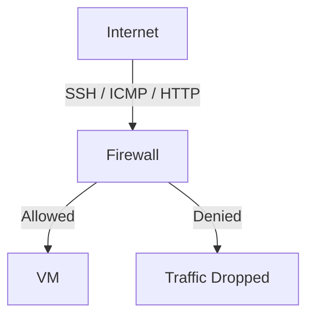
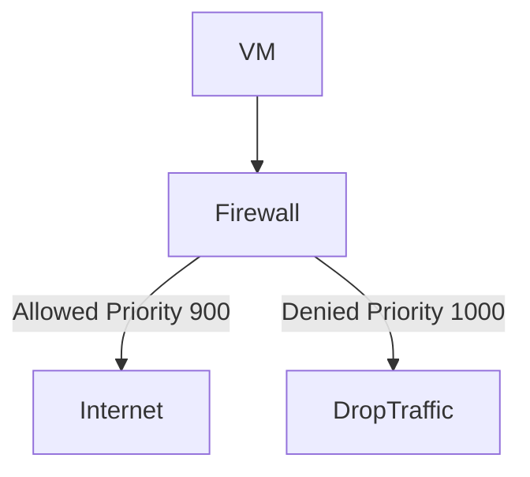
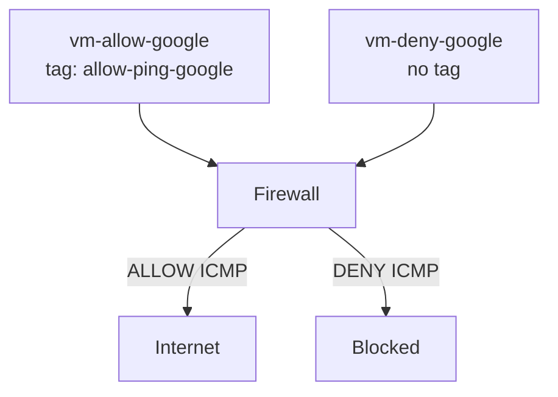
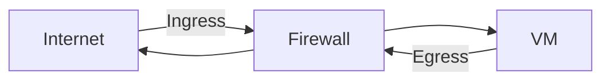

# Ingress = Traffic entering a VM
- By default, incoming traffic is denied unless explicitly allowed.
- To allow traffic into the VMs through SSH(TCP 22), ICMP(ping), HTTP(TCP 80) firewall rules must be created.
- Target tags identify which VMs the firewall rules apply to.
- Allow or deny depends on the priority level of the firewall rule.




# Egress = Traffic leaving the VM
- By default, outgoing traffic is allowed unless explicitly denied.
- To restrict the traffic outbound, egress firewall rules must be created. 
- Target tags identify which VMs the firewall rules apply to.
- Allow or deny depends on the priority level of the firewall rule 




# Priority level: 
Lower priority number = higher precedence

## Example for reference 

## Configuration (Update Before Running)

```bash
export PROJECT_ID="your-project-id"
export REGION="us-central1"
export ZONE="us-central1-a"
export VPC_NAME="custom-vpc"
export SUBNET_NAME="subnet-a"

gcloud config set project $PROJECT_ID
```

### Enable Compute API
```bash
echo "Enabling Compute API..."
gcloud services enable compute.googleapis.com
```

### Create a custom network $VPC_NAME 
```bash
gcloud compute networks create $VPC_NAME \
  --subnet-mode=custom
echo "Network $VPC_NAME created successfully..."
```


### Create subnet-a in custom-vpc
```bash
gcloud compute networks subnets create $SUBNET_NAME \
  --network=$VPC_NAME \
  --region=$REGION \
  --range=10.2.1.0/24
echo "$SUBNET_NAME created successfully..."
```

### Create vm-allow-google in subnet-a
```bash
gcloud compute instances create vm-allow-google \
  --zone=$ZONE \
  --subnet=$SUBNET_NAME \
  --machine-type=e2-micro \
  --tags=allow-ping-google
echo "Instance vm-allow-google created successfully.."
```

### Create vm-deny-google in subnet-a
```bash
gcloud compute instances create vm-deny-google \
    --zone=$ZONE \
    --subnet=$SUBNET_NAME \
    --machine-type=e2-micro
echo "Instance vm-deny-google created successfully.."
```

### Create a firewall rule to allow SSH access 
```bash
gcloud compute firewall-rules create allow-ssh \
  --description="allow-ssh port 22 for all instances " \
  --direction=INGRESS \
  --priority=1000 \
  --network=$VPC_NAME \
  --action=ALLOW \
  --rules=tcp:22 \
  --source-ranges=0.0.0.0/0
echo "Firewall rule allow SSH created successfully.."
```

### Create a firewall rule which allows icmp 
```bash
gcloud compute firewall-rules create allow-icmp-subnet-a \
  --description="allow icmp from subnet-a 10.2.1.0/24" \
  --direction=INGRESS \
  --priority=1000 \
  --network=$VPC_NAME \
  --action=ALLOW \
  --rules=icmp \
  --source-ranges=10.2.1.0/24
echo "Firewall rule allow-icmp created successfully.."
```
> This rule allows ICMP traffic originating from subnet-a to all VMs in the VPC.


### Log in to VM 
> This allows to login into vm-allow-google instance
```bash
gcloud compute ssh vm-allow-google --zone=$ZONE \
  --project=$PROJECT_ID
```

> This allows to login into vm-deny-google 
```bash
gcloud compute ssh vm-deny-google  --zone=$ZONE \
  --project=$PROJECT_ID
```

## Creating firewall rules to allow or deny egress traffic 

### Creating firewall rule to deny egress traffic to deny google 
```bash
gcloud compute firewall-rules create deny-google \
    --direction=EGRESS \
    --priority=1000 \
    --network=$VPC_NAME \
    --action=DENY \
    --rules=icmp \
    --destination-ranges=8.8.8.8/32
```
> This firewall rule denies ICMP egress traffic to 8.8.8.8 for all VMs unless overridden by a higher-priority allow rule. 

### Creating firewall rule to allow egress traffic to ping google 
```bash
gcloud compute firewall-rules create allow-google \
    --direction=EGRESS \
    --priority=900 \
    --network=$VPC_NAME \
    --action=ALLOW \
    --rules=icmp \
    --destination-ranges=8.8.8.8/32 \
    --target-tags=allow-ping-google
```
> This firewall rule allows the egress traffic only to the VM with specific target tag allow-ping-google as the priority is 900 





### Firewalls are created for Egress traffic 
```bash
ping 8.8.8.8
```
- Now ping 8.8.8.8 from two VM instances to check whether egress traffic is allowed or not.
- Here instance vm-allow-google allows egress traffic and vm-deny-google denies egress traffic. 

## Cleanup (Avoid Charges)


```bash
gcloud compute firewall-rules delete allow-ssh allow-icmp-subnet-a deny-google allow-google
gcloud compute instances delete vm-allow-google vm-deny-google --zone=$ZONE
gcloud compute networks subnets delete $SUBNET_NAME --region=$REGION
gcloud compute networks delete $VPC_NAME
```


