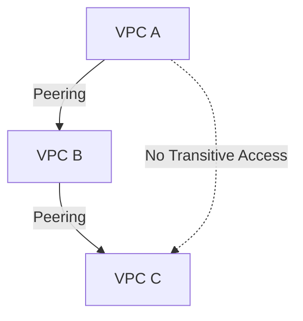

# VPC Peering
VPC Peering is used to connect two VPC networks within Google Cloud so they can communicate with each other using internal IP addresses.
Peering provides private, internal connectivity.

## Restrictions & Characteristics: 

1. The CIDR Range of the peered VPC networks must not overlap.
2. VPC peering works only between Google Cloud VPC networks.
3. Once peered, routes to all non-overlapping subnets are exchanged. Firewalls can be used to restrict traffic.
4. Firewall rules (including network tags and service accounts) are evaluated in the destination VPC for peered traffic.
5. Firewall rules are not shared between VPCs. Each VPC enforces its own firewall rules independently.
6. VPC peering is non-transitive. If vpc-a is peered with vpc-b and vpc-b is peered with vpc-c, vpc-a cannot communicate with vpc-c



#### Understanding this with an example:

Creating... 

1. vpc-a with subnet-1a, subnet-2a, firewall rules - ssh, icmp and instance-1a
2. vpc-b with subnet-1b, subnet-2b, subnet conflict-with-subnet-1a firewall rules - ssh, icmp and instance-1b
3. vpc-c with subnet-1c, subnet-2c, subnet conflict-with-subnet-1b firewall rules - ssh, icmp and instance-1c


```bash
# Enable compute API
echo "Enabling computing API..."
gcloud services enable compute.googleapis.com


# Create a vpc-a and subnet-1a, Subnet-2A
echo "Creating vpc-a & Subnets.."
gcloud compute networks create vpc-a --subnet-mode=custom
gcloud compute networks subnets create subnet-1a --network=vpc-a --region=us-central1 --range=10.0.1.0/24
gcloud compute networks subnets create subnet-2a --network=vpc-a --region=us-central1 --range=10.1.1.0/24


# Create a vpc-b and subnet-1b, subnet-2b
echo "Creating vpc-b & Subnets..."
gcloud compute networks create vpc-b --subnet-mode=custom
gcloud compute networks subnets create subnet-1b --network=vpc-b --region=us-central1 --range=10.0.2.0/24
gcloud compute networks subnets create subnet-2b --network=vpc-b --region=us-central1 --range=10.1.2.0/24
gcloud compute networks subnets create conflict-with-subnet-1a --network=vpc-b --region=us-central1 --range=10.0.1.0/24

# Create a vpc-c and subnet-1c, Subnet-2C
echo "Creating vpc-c & Subnets..."
gcloud compute networks create vpc-c --subnet-mode=custom
gcloud compute networks subnets create subnet-1c --network=vpc-c --region=us-central1 --range=10.0.3.0/24
gcloud compute networks subnets create subnet-2c --network=vpc-c --region=us-central1 --range=10.1.3.0/24
gcloud compute networks subnets create conflict-with-subnet-1b --network=vpc-c --region=us-central1 --range=10.0.2.0/24

# Create firewall rules fo vpc-a
echo "Creating firewall rules ssh & icmp for vpc-a..."
gcloud compute firewall-rules create vpc-a-allow-ssh --direction=INGRESS --priority=1000 --network=vpc-a --action=ALLOW --rules=tcp:22 --source-ranges=0.0.0.0/0
gcloud compute firewall-rules create vpc-a-allow-icmp --direction=INGRESS --priority=1000 --network=vpc-a --action=ALLOW --rules=icmp --source-ranges=0.0.0.0/0

# Create firewall rules fo vpc-b
echo "Creating firewall rules ssh & icmp for vpc-b..."
gcloud compute firewall-rules create vpc-b-allow-ssh --direction=INGRESS --priority=1000 --network=vpc-b --action=ALLOW --rules=tcp:22 --source-ranges=0.0.0.0/0
gcloud compute firewall-rules create vpc-b-allow-icmp --direction=INGRESS --priority=1000 --network=vpc-b --action=ALLOW --rules=icmp --source-ranges=0.0.0.0/0

# Create firewall rules fo vpc-c
echo "Creating firewall rules ssh & icmp for vpc-c..."
gcloud compute firewall-rules create vpc-c-allow-ssh --direction=INGRESS --priority=1000 --network=vpc-c --action=ALLOW --rules=tcp:22 --source-ranges=0.0.0.0/0
gcloud compute firewall-rules create vpc-c-allow-icmp --direction=INGRESS --priority=1000 --network=vpc-c --action=ALLOW --rules=icmp --source-ranges=0.0.0.0/0


# Create VM instances in subnet-1a, subnet-1b, subnet-1c
echo "Creating VM instances..."
gcloud compute instances create instance-1a --zone=us-central1-a --machine-type=e2-micro --subnet=subnet-1a 
gcloud compute instances create instance-1b --zone=us-central1-a --machine-type=e2-micro --subnet=subnet-1b
gcloud compute instances create instance-1c --zone=us-central1-a --machine-type=e2-micro --subnet=subnet-1c


echo "Creation completed..."
```

Note: 0.0.0.0/0 is used only for lab simplicity. In production, always restrict source ranges.

### Test ICMP between instances 

Login to instances using gcloud command 

``` bash
# instance-1a SSH login
gcloud compute ssh --zone "us-central1-a" "instance-1a" --project "PROJECT_ID"

Ping <instance-1a-private-ip>


# instance-1b SSH login
gcloud compute ssh --zone "us-central1-a" "instance-1b" --project "PROJECT_ID"

Ping <instance-1b-private-ip>

# instance-1a SSH login
gcloud compute ssh --zone "us-central1-a" "instance-1c" --project "PROJECT_ID"

Ping <instance-1c-private-ip>
```

Even though ICMP is allowed from 0.0.0.0/0, firewall rules are evaluated in the destination VPC and do not automatically permit traffic from peered networks unless explicitly allowed.

Now we will work on communicating with the instances from other network i.e., it will be done using VPC peering 

## Establishing peering connection

### **VPC network Peering:**
Cloud VPC Network Peering lets you privately connect two VPC networks, which can reduce latency, cost, and increase security. 

Required info. Learn more [VPC Peering](https://docs.cloud.google.com/vpc/docs/vpc-peering?authuser=1&_gl=1*1y5bxfg*_ga*NjEyMTc2NjExLjE3NjU0MjEyMzE.*_ga_WH2QY8WWF5*czE3NjgxODQ3MTgkbzE5JGcxJHQxNzY4MTg1NTAwJGo3JGwwJGgw)

- The project ID (if you are connecting to a VPC network in another project)
- The name of the VPC network you want to peer with

### Before peering will resolve the conflicts

* As per peering restrictions, CIDR ranges must not overlap between peered VPCs.

- But, here in our example vpc-a subnet-1a is overlapping with vpc-b subnet conflict-with-subnet-1a. 
Will delete the subnet before creating a peering between networks vpc-a & vpc-b 

- Similarly, conflict-with-subnet-1b overlaps with subnet-1b in vpc-b, so it must be deleted before peering vpc-b and vpc-c.


```bash

# Deleting conflicting subnets before peering

gcloud compute networks subnets delete conflict-with-subnet-1a --region=us-central1 --quiet

gcloud compute networks subnets delete conflict-with-subnet-1b --region=us-central1 --quiet
```

#### VPC network peering between vpc-a and vpc-b

```bash
# VPC Peering from vpc-a to vpc-b
gcloud compute networks peerings create vpc-a-to-vpc-b --network=vpc-a --peer-network=vpc-b

# VPC Peering from vpc-b to vpc-a
gcloud compute networks peerings create vpc-b-to-vpc-a --network=vpc-b --peer-network=vpc-a
```

Peering must be done two way to establish connection i.e., vpc-a to vpc-b & vpc-b to vpc-a 


#### VPC network peering between vpc-b and vpc-c

```bash
# VPC Peering from vpc-b to vpc-c
gcloud compute networks peerings create vpc-b-to-vpc-c --network=vpc-b --peer-network=vpc-c

# VPC Peering from vpc-c to vpc-b
gcloud compute networks peerings create vpc-c-to-vpc-b --network=vpc-c --peer-network=vpc-b
```

Peering must be done two way to establish connection i.e., vpc-b to vpc-c & vpc-c to vpc-b 


Note: Here we can try pinging instance-1a from instance-1c (vice versa) which will not allow because we have not added any peering between this networks and VPC peering is non-transitive. 

```
# Non-transitive peering
vpc-a <-> vpc-b
vpc-b <-> vpc-c
vpc-a ❌ vpc-c
```


### Clean up infrastructure (To avoid Charges)


```bash

# Delete VM instances
echo "Deleting VM instances..."
gcloud compute instances delete instance-1a --zone=us-central1-a --quiet
gcloud compute instances delete instance-1b --zone=us-central1-a --quiet
gcloud compute instances delete instance-1c --zone=us-central1-a --quiet

# Delete firewall rules
echo "Deleting firewall rules..."
gcloud compute firewall-rules delete vpc-a-allow-ssh vpc-a-allow-icmp --quiet
gcloud compute firewall-rules delete vpc-b-allow-ssh vpc-b-allow-icmp --quiet
gcloud compute firewall-rules delete vpc-c-allow-ssh vpc-c-allow-icmp --quiet

# Delete VPC peering
gcloud compute networks peerings delete vpc-a-to-vpc-b --network=vpc-a --quiet
gcloud compute networks peerings delete vpc-b-to-vpc-a --network=vpc-b --quiet
gcloud compute networks peerings delete vpc-b-to-vpc-c --network=vpc-b --quiet
gcloud compute networks peerings delete vpc-c-to-vpc-b --network=vpc-c --quiet

# Delete subnets
echo "Deleting subnets and VPCs..."
gcloud compute networks subnets delete subnet-1a subnet-2a --region=us-central1 --quiet
gcloud compute networks subnets delete subnet-1b subnet-2b --region=us-central1 --quiet
gcloud compute networks subnets delete subnet-1c subnet-2c --region=us-central1 --quiet

#Delete VPC networks
gcloud compute networks delete vpc-a --quiet
gcloud compute networks delete vpc-b --quiet
gcloud compute networks delete vpc-c --quiet

echo "Cleanup successful..."
```


## Key Takeaways

- VPC peering enables private communication using internal IPs
- CIDR ranges must not overlap between peered VPCs
- Firewall rules are evaluated in the destination VPC
- Firewall rules are not shared across peered networks
- VPC peering is non-transitive
- Routing does not guarantee connectivity without firewall rules
