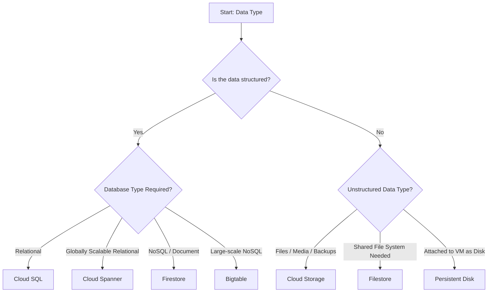

# Storage options in Google Cloud Platform

Google Cloud Platform (GCP) provides multiple storage services designed for different workloads. Choosing the correct storage depends on:
- Type of data (Structured/Unstructured)
- Access Pattern (frequent/infrequent)
- Performance requirement
- Latency requirement
- Sharing requirements
- Cost considerations

## Types of storage options in GCP
1. Block storage (Disks attached to VMs)
2. Object storage (Cloud Storage -GCS)
3. File storage (Filestore-NFS)
4. Managed Database storage

## Storage Decision Flow

## Object storage[GCS](../GCS.md)

## Block storage 
Block storage is disk-based storage attached directly to Compute Engine VMs.

Google cloud provides two main categories:
1. **Durable block storage:** Used for long-term retention

**Includes:**
- Persistent Disk (PD)
- Hyper disk

**These Disks:**
- Survive VM restarts and crashes
- Can be zonal or regional
- Support snapshots
- Are billed even if VM is stopped

2. **Temporary (Ephemeral) Block Storage:** Used for temporary storage

**Includes**
- Local SSD

**Characteristics**
- Physically attached to host machine
- High performance
- Data is lost if VM stops or crashes
- Cannot be used as boot disk
- Must be attached during VM creation

**Use Cases**
- Caching
- Scratch space
- Temporary high-speed processing

### Persistent disk (pd)
- Network-attached storage
- Can be boot disk or data disk
- Can be resized (increase only)
- Zonal or Regional
- Types:
    - Standard (HDD)
    - Balanced
    - Extreme
    - SSD 
    - Hyperdisk (various performance tiers)

### Hyperdisk
High-performance block storage designed for enterprise workloads.
- Adjustable performance
- Designed for large-scale databases
- Suitable for demanding workloads

## Object Storage [GCS](../GCS.md)

## File Storage
**Filestore**
Filestore is a managed Network File System (NFS) service.

**Best Use Cases**
- Shared file systems
- Applications requiring POSIX file systems
- Lift-and-shift workloads
- Multiple VMs needing shared storage

**Key Characteristics**
- Managed NFS
- Mountable on multiple VMs
- Suitable for enterprise applications

## Managed Database Storage
These services store structured data.
 
**Cloud SQL**
- Managed relational database (MySQL, PostgreSQL, SQL Server)

**Cloud Spanner**
- Globally distributed relational database
- High availability and scalability

**Firestore**
- NoSQL document database
- Real-time applications

**Bigtable**
- NoSQL wide-column database
- Large-scale analytical workloads
