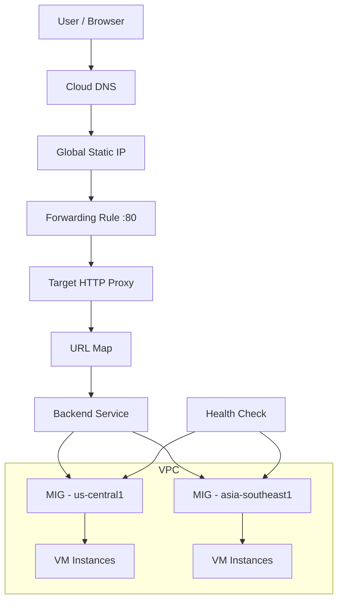
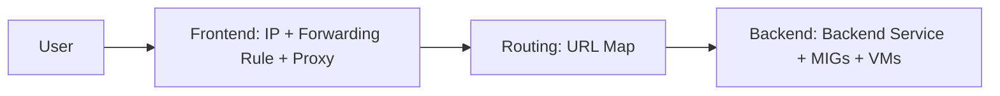

# What is Load Balancing?
A Load Balancer distributes incoming client traffic across multiple backend resources to ensure:
- High availability
- Fault tolerance
- Scalability
- Low latency
- Better performance

Instead of one server handling all traffic, the load balancer intelligently distributes requests across multiple servers.

## Why Is Load Balancing Important?
**Without a load balancer**
- Single server failure = downtime
- High traffic can overload one server
- No automatic failover
- Poor performance

**With load balancing**
- Traffic distributed across instances
- Automatic failover
- Auto-scaling integration
- Global routing

## Different Types of Load Balancers in GCP
GCP provides multiple load balancers depending on use case:
| Type                      | Layer   | Scope    | Use Case                 |
| ------------------------- | ------- | -------- | ------------------------ |
| Global External HTTP(S)   | Layer 7 | Global   | Web applications         |
| Regional External HTTP(S) | Layer 7 | Regional | Regional apps            |
| Internal HTTP(S)          | Layer 7 | Regional | Internal services        |
| TCP/SSL Proxy             | Layer 4 | Global   | Non-HTTP traffic         |
| Network Load Balancer     | Layer 4 | Regional | High-performance TCP/UDP |


In this chapter, we focus on **Global External Application Load Balancer (HTTP)**.

## Global HTTP Load Balancer Overview
This load balancer:
- Uses a Global Static IP
- Operates at Layer 7
- Supports path-based routing
- Supports multi-region backends
- Uses Google’s global network
- Provides latency-based routing



Before we proceed further, let’s understand a few key components.

### Instance Template
An Instance Template defines the configuration for VM instances.
It includes:
- Machine type
- Network & subnet
- Startup script
- Boot disk
- Metadata

Think of it as a blueprint for creating identical VMs.

### Instance Group in GCP
An Instance Group in Google Cloud is a collection of Virtual Machine (VM) instances that can be managed together as a single logical unit.

Instead of managing VMs individually, an instance group allows you to :
- Organize VMs
- Attach them to a Load Balancer
- Apply policies collectively
- Scale them together (if managed)

### Why do we need Instance Groups?
Instead of manually attaching each VM to the backend, you attach the Instance Group. 
This makes management easier and scalable. 

### Types of Instance Groups
There are two types:

**1) Managed Instance Group (MIG)**
A Managed Instance Group:
- Uses an Instance Template
- Automatically creates VMs
- Maintains a defined number of instances
- Supports auto-healing
- Supports auto-scaling
- Supports rolling updates

**Example:** If you define 
```bash
--size=3
```
The MIG ensures that 3 VMs are always running. 
If one VM fails:
MIG automatically recreates it 

**2) Unmanaged Instance Group (UMIG)**
An Unmanaged Instance Group:
- Is a logical grouping of existing VMs
- Does **not** auto-create instances
- Does **not** auto-heal
- Does **not** auto-scale

You manually manage all VMs.

#### MIG vs UMIG Comparison
| Feature                | MIG         | UMIG  |
| ---------------------- | ----------- | ----- |
| Uses Instance Template | ✅ Yes       | ❌ No  |
| Auto-scaling           | ✅ Yes       | ❌ No  |
| Auto-healing           | ✅ Yes       | ❌ No  |
| Rolling updates        | ✅ Yes       | ❌ No  |
| Manual VM creation     | ❌ No        | ✅ Yes |
| Production usage       | Very common | Rare  |


### How Instance Groups work with a Load Balancer
In Load Balancer architecture:
- Backend service connects to Instance Group
- Instance Group contains VMs
- Health check monitors the group
- Traffic is distributed to healthy VMs

So instead of attaching individual VMs:
- You attach the Instance Group.

### Health Check
A Health Check monitors backend instances.

It:
- Sends an HTTP request to /
- Verifies instance response
- Marks instance healthy/unhealthy
- Prevents traffic from going to unhealthy VMs

Health checks ensure reliability.

## Frontend -> Routing -> Backend
**1) Frontend**
Frontend consists of:
- Global Static IP
- Forwarding Rule
- Target HTTP Proxy

This is the entry point of traffic.

**2) Routing**
URL Map determines:
- Which backend receives traffic
- Can route by:
    - Hostname
    - Path
    - Rules
**Example:**
- /app1 -> Backend A
- /api -> Backend B

**3) Backend Service**
Backend service:
- Connects to Managed Instance Groups
- Uses Health Checks
- Distributes traffic




## How It Routes to the Nearest Region
Global HTTP Load Balancer:
- Uses an Anycast IP to route users to the nearest healthy Google edge location, helping reduce latency.
- Uses Google's private backbone
- Routes traffic based on:
  - Latency
  - Proximity
  - Health status
**Example:**
User in USA -> us-central1
User in Singapore/India -> asia-southeast1

If us-central1 fails:
Traffic automatically routes to asia-southeast1

**This provides:**
- High availability
- Disaster recovery
- Low latency


### Resources created in sequence
VPC (`vpc-alb`) → Subnets (`subnet-alb-central`, `subnet-alb-asia`) → Firewall rules (`allow-ssh-icmp-http`, `allow-health-checks`) → Startup script (`startup-script.sh`) → Instance templates (`instance-central`, `instance-asia`) → Global health check (`health-check`) → Managed instance groups (`alb-mig-central`, `alb-mig-asia`) → Named ports → Global static IP (`alb-global-ip`) → Backend service (`alb-backend-service`) → URL map (`alb-url-map`) → Target HTTP proxy (`alb-http-proxy`) → Forwarding rule (`alb-forwarding-rule`)


```bash
# setup commands
### Create VPC Network
gcloud compute networks create vpc-alb \
    --subnet-mode=custom
echo "VPC Network created.."

### Create Subnet in us-central1 & asia-southeast1

# Subnet in us-central1
gcloud compute networks subnets create subnet-alb-central \
    --network=vpc-alb \
    --region=us-central1 \
    --range=10.0.0.0/24
echo "Subnet in us-central1 created..."

# Subnet in asia-southeast1

gcloud compute networks subnets create subnet-alb-asia \
    --network=vpc-alb \
    --region=asia-southeast1 \
    --range=10.1.0.0/24
echo "Subnet in asia-southeast1 created..."

### Create Firewall Rules

### Allow SSH(Port 22), HTTP(Port 80), and ICMP from any Source

gcloud compute firewall-rules create allow-ssh-icmp-http \
    --network=vpc-alb \
    --allow=tcp:22,tcp:80,icmp \
    --source-ranges=0.0.0.0/0
echo "Firewall rules created."

# Note: Opening SSH (22) to `0.0.0.0/0` is acceptable for lab practice, but in production it should be restricted to trusted IP ranges or replaced with IAP/OS Login.

### Health Check firewall-rule
# Note: Google Cloud Health Checks use specific ip ranges (130.211.0.0/22 and 35.191.0.0/16). Always include these IP ranges in firewall rules to avoid failed health checks. 


gcloud compute firewall-rules create allow-health-checks \
    --network=vpc-alb \
    --allow=tcp:80 \
    --source-ranges=130.211.0.0/22,35.191.0.0/16
echo "Health check firewall rule created...."


### Define and Save the Startup Script

STARTUP_SCRIPT_CONTENT=$(cat <<'SCRIPT'
#!/bin/bash
set -e

apt-get update -y
apt-get install -y nginx curl
systemctl enable nginx
systemctl start nginx

HOSTNAME=$(hostname)
ZONE=$(curl -s -H "Metadata-Flavor: Google" \
  http://metadata.google.internal/computeMetadata/v1/instance/zone | awk -F/ '{print $NF}')
REGION=$(echo "$ZONE" | sed 's/-[a-z]$//')
TIMESTAMP=$(date)

cat > /var/www/html/index.html <<HTML
<!DOCTYPE html>
<html lang="en">
<head>
  <meta charset="UTF-8">
  <meta name="viewport" content="width=device-width, initial-scale=1.0">
  <title>GCP Load Balancer Success</title>
  <style>
    body {
      margin: 0;
      font-family: Arial, sans-serif;
      background: linear-gradient(-45deg, #4285F4, #34A853, #FBBC05, #EA4335);
      background-size: 400% 400%;
      animation: gradientBG 12s ease infinite;
      color: white;
      text-align: center;
      overflow: hidden;
    }
    @keyframes gradientBG {
      0% { background-position: 0% 50%; }
      50% { background-position: 100% 50%; }
      100% { background-position: 0% 50%; }
    }
    .container {
      margin-top: 8%;
      background: rgba(0, 0, 0, 0.35);
      padding: 35px;
      border-radius: 20px;
      width: 70%;
      margin-left: auto;
      margin-right: auto;
      box-shadow: 0 8px 25px rgba(0,0,0,0.3);
      animation: fadeIn 2s ease-in-out;
    }
    @keyframes fadeIn {
      from { opacity: 0; transform: translateY(20px); }
      to { opacity: 1; transform: translateY(0); }
    }
    h1 {
      font-size: 42px;
      margin-bottom: 10px;
      animation: pulse 2s infinite;
    }
    @keyframes pulse {
      0% { transform: scale(1); }
      50% { transform: scale(1.05); }
      100% { transform: scale(1); }
    }
    p {
      font-size: 22px;
      margin: 10px 0;
    }
    .highlight {
      font-weight: bold;
      color: #FFD54F;
    }
    .footer {
      margin-top: 25px;
      font-size: 18px;
      opacity: 0.9;
    }
    .badge {
      display: inline-block;
      margin: 8px;
      padding: 10px 18px;
      border-radius: 25px;
      background: rgba(255,255,255,0.18);
      font-size: 20px;
      font-weight: bold;
    }
    .note {
      margin-top: 20px;
      font-size: 18px;
      color: #E3F2FD;
    }
  </style>
</head>
<body>
  <div class="container">
    <h1>🎉 Congratulations!</h1>
    <p>You have successfully created a <span class="highlight">Google Cloud Load Balancer</span>.</p>
    <p>This request was served by the backend VM below:</p>
    <div class="badge">Host: $HOSTNAME</div>
    <div class="badge">Zone: $ZONE</div>
    <div class="badge">Region: $REGION</div>
    <p class="footer">Response generated on: $TIMESTAMP</p>
    <p class="note">Refresh the page multiple times to see traffic served from different backends and regions.</p>
  </div>
</body>
</html>
HTML
SCRIPT
)
echo "$STARTUP_SCRIPT_CONTENT" > startup-script.sh
chmod +x startup-script.sh
echo "Startup script created.."

### Create Instance templates for us-central1 & asia-southeast1

# Instance template for us-central1 
gcloud compute instance-templates create instance-central \
    --machine-type=e2-micro \
    --network=vpc-alb \
    --subnet=subnet-alb-central \
    --metadata-from-file startup-script=startup-script.sh
echo "Instance template for us-central1 created..."

# Instance template for asia-southeast1
gcloud compute instance-templates create instance-asia \
    --machine-type=e2-micro \
    --network=vpc-alb \
    --subnet=subnet-alb-asia \
    --metadata-from-file startup-script=startup-script.sh
echo "Instance template for asia-southeast1 created..."

### Create a Global Health Check
gcloud compute health-checks create http health-check \
    --global \
    --port 80 \
    --request-path="/"
echo "Global health check created..."

export PROJECT_ID=$(gcloud config get-value project)
echo $PROJECT_ID

 
### Create a Managed Instance Group 
# Managed instance group in us-central1
gcloud compute instance-groups managed create alb-mig-central \
    --base-instance-name=mig-central1 \
    --template=instance-central \
    --size=2 \
    --region=us-central1
echo "Managed instance group in us-central1 created..."

# Managed instance group in asia-southeast1
gcloud compute instance-groups managed create alb-mig-asia \
    --base-instance-name=mig-asia1 \
    --template=instance-asia \
    --size=2 \
    --region=asia-southeast1
echo "Managed instance group in asia-southeast1 created..."

gcloud compute instance-groups managed update alb-mig-central \
    --region=us-central1 \
    --health-check=health-check \
    --initial-delay=300

gcloud compute instance-groups managed update alb-mig-asia \
    --region=asia-southeast1 \
    --health-check=health-check \
    --initial-delay=300

### Set named ports for each managed instance group
### Set Named port for each MIG
# Named port for us-central1 MIG
gcloud compute instance-groups managed set-named-ports alb-mig-central \
    --named-ports=http:80 \
    --region=us-central1
echo "Named ports set for us-central1 MIG..."

# Named port for asia-southeast1 MIG
gcloud compute instance-groups managed set-named-ports alb-mig-asia \
    --named-ports=http:80 \
    --region=asia-southeast1
echo "Named ports set for asia-southeast1 MIG..."

### Create a Static Global IP address
gcloud compute addresses create alb-global-ip --global
echo "Static external IP address created..."

### Create a Backend service
gcloud compute backend-services create alb-backend-service \
    --global \
    --protocol=HTTP \
    --health-checks=health-check \
    --port-name=http \
    --load-balancing-scheme=EXTERNAL_MANAGED \
    --locality-lb-policy=ROUND_ROBIN \
    --connection-draining-timeout=300 \
    --session-affinity=NONE \
    --timeout=30

### Add the us-central1 instance group to the backend service
gcloud compute backend-services add-backend alb-backend-service \
    --global \
    --instance-group=alb-mig-central \
    --instance-group-region=us-central1

### Add the asia instance group to the backend service
gcloud compute backend-services add-backend alb-backend-service \
    --global \
    --instance-group=alb-mig-asia \
    --instance-group-region=asia-southeast1

### Create a URL Map: Load Balancer configuration
gcloud compute url-maps create alb-url-map \
    --default-service=alb-backend-service

### Create a Target HTTP proxy 
gcloud compute target-http-proxies create alb-http-proxy \
    --url-map=alb-url-map

### Create a forwarding rule
gcloud compute forwarding-rules create alb-forwarding-rule \
    --global \
    --target-http-proxy=alb-http-proxy \
    --address=alb-global-ip \
    --ports=80


### Get static IP
STATIC_IP=$(gcloud compute addresses describe alb-global-ip --global --format="get(address)")
echo $STATIC_IP

echo "Waiting 300 seconds for load balancer and backends to become healthy..."
sleep 300

### Check backend health
echo "Checking backend health..."
gcloud compute backend-services get-health alb-backend-service --global

### Test load balancer
echo "Testing load balancer..."
curl http://$STATIC_IP

```

### Optional: Add DNS Record
```bash
gcloud dns record-sets create www.example.com. \
    --zone=my-zone \
    --type=A \
    --ttl=300 \
    --rrdatas=$STATIC_IP
```

**Note:** Replace `example.com` and `my-zone` with your actual domain and Cloud DNS managed zone.

### Cleanup (To avoid Charges)

```bash
# cleanup commands
### Delete the forwarding rule 
gcloud compute forwarding-rules delete alb-forwarding-rule --global --quiet

### Delete the target http proxy 
gcloud compute target-http-proxies delete alb-http-proxy --quiet

### Delete the url-map
gcloud compute url-maps delete alb-url-map --quiet

### Delete the backend service
gcloud compute backend-services delete alb-backend-service --global --quiet

### Delete the static external IP address
gcloud compute addresses delete alb-global-ip --global --quiet

### Remove named ports from managed instance groups 
gcloud compute instance-groups managed set-named-ports alb-mig-central --named-ports= --region=us-central1 --quiet

gcloud compute instance-groups managed set-named-ports alb-mig-asia --named-ports= --region=asia-southeast1 --quiet

### Delete Managed instance groups 
gcloud compute instance-groups managed delete alb-mig-central --region=us-central1 --quiet
gcloud compute instance-groups managed delete alb-mig-asia --region=asia-southeast1 --quiet

### Delete health check
gcloud compute health-checks delete health-check --global --quiet

### Delete instance templates
gcloud compute instance-templates delete instance-central --quiet
gcloud compute instance-templates delete instance-asia --quiet

### Delete Firewall-rules 
gcloud compute firewall-rules delete allow-ssh-icmp-http --quiet
gcloud compute firewall-rules delete allow-health-checks --quiet

### Delete subnets
gcloud compute networks subnets delete subnet-alb-central --region=us-central1 --quiet
gcloud compute networks subnets delete subnet-alb-asia --region=asia-southeast1 --quiet

### Delete vpc
gcloud compute networks delete vpc-alb --quiet
```
