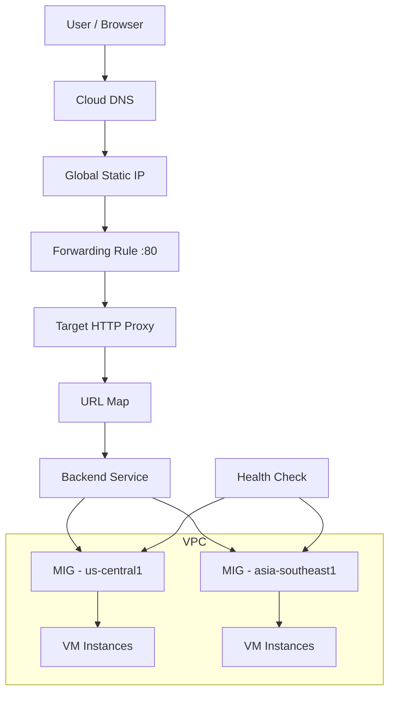
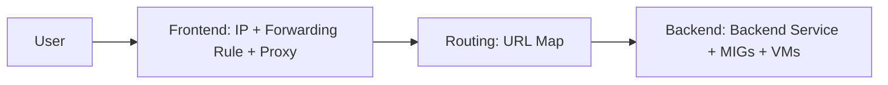

# What is Load Balancing?
A Load Balancer distributes incoming client traffic across multiple backend resources to ensure:
- High availability
- Fault tolerance
- Scalability
- Low latency
- Better performance

Instead of one server handling all traffic, the load balancer intelligently distributes requests across multiple servers.

## Why Load Balancing is important?
**Without a load balancer**
- Single server failure = downtime
- High traffic can overload one server
- No automatic failover
- Poor performance

**With load balancing**
- Traffic distributed across instances
- Automatic failover
- Auto-scaling integration
- Global routing

## Different types of Load Balancers in GCP 
GCP provides multiple load balancers depending on use case:
| Type                      | Layer   | Scope    | Use Case                 |
| ------------------------- | ------- | -------- | ------------------------ |
| Global External HTTP(S)   | Layer 7 | Global   | Web applications         |
| Regional External HTTP(S) | Layer 7 | Regional | Regional apps            |
| Internal HTTP(S)          | Layer 7 | Regional | Internal services        |
| TCP/SSL Proxy             | Layer 4 | Global   | Non-HTTP traffic         |
| Network Load Balancer     | Layer 4 | Regional | High-performance TCP/UDP |


In this chapter, we focus on:

```**Global External Application Load Balancer(HTTP)**```

### Global HTTP Load Balancer – Overview

This load balancer:
- Uses a Global Static IP
- Operates at Layer 7
- Supports path-based routing
- Supports multi-region backends
- Uses Google’s global network
- Provides latency-based routing



Before we proceed further let's learn about few key components

### Instance template
An Instance Template defines the configuration for VM instances.
It includes:
- Machine type
- Network & subnet
- Startup script
- Boot disk
- Metadata

Think of it as a blue print for creating identical VMs.

### Instance Group in GCP
An Instance Group in Google Cloud is a collection of Virtual Machine (VM) instances that can be managed together as a single logical unit.

Instead of managing VMs individually, an instance group allows you to :
- Organise VMs
- Attach them to a Load Balancer
- Apply policies collectively
- Scale them together (if managed)

### Why do we need Instance Groups?
Instead of manually attaching each VM to the backend, you attach the Instance Group. 
This makes management easier and scalable. 

### Types of Instance Groups
There are two types:

**1) Managed Instance Group (MIG)**
A Managed Instance Group:
- Uses an Instance Template
- Automatically creates VMs
- Maintains a defined number of instances
- Supports auto-healing
- Supports auto-scaling
- Supports rolling updates

**Example:** If you define 
```bash
--size=3
```
The MIG ensures that 3 VMs are always running. 
If one VM fails:
MIG automatically recreates it 

**2) Unmanaged Instance Group (UMIG)**
An Unmanaged Instance Group:
- Is just grouping of existing VMs
- Does **not** auto-create instances
- Does **not** auto-heal
- Does **not** auto-scale

You manually manage all VMs.

#### MIG vs UMIG Comparison
| Feature                | MIG         | UMIG  |
| ---------------------- | ----------- | ----- |
| Uses Instance Template | ✅ Yes       | ❌ No  |
| Auto-scaling           | ✅ Yes       | ❌ No  |
| Auto-healing           | ✅ Yes       | ❌ No  |
| Rolling updates        | ✅ Yes       | ❌ No  |
| Manual VM creation     | ❌ No        | ✅ Yes |
| Production usage       | Very common | Rare  |


### How Instance Groups work with Load Balancer
In Load Balancer architecture:
- Backend service connects to Instance Group
- Instance Group contains VMs
- Health check monitors the group
- Traffic is distributed to healthy VMs

So insteas of attaching individual VMs:
- You attach the Instance Group.

### Health Check
A Health Check monitors backend instances.

It:
- sends HTTP request to /
- Verifies instance response
- Marks instance healthy/unhealthy
- Prevents traffic from going to unhealthy VMs

Health checks ensure reliability.

## Frontend -> Routing -> Backend
**1) Frontend**
Frontend consists of:
- Global Static IP
- Forwarding Rule
- Target HTTP Proxy

This is the entry point of traffic.

**2) Routing**
URL Map determines:
- Which backend receives traffic
- Can route by:
    . Hostname
    . Path
    . Rules
**Example:**
- /app1 -> Backend A
- /api -> Backend B

**3) Backend Service**
Backend service:
- Connects to Managed Instance Groups
- Uses Health Checks
- Distributes traffic




