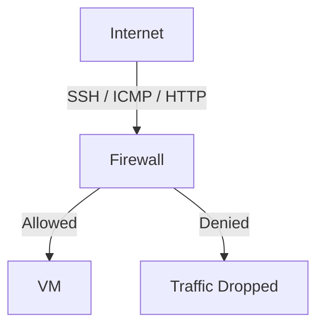
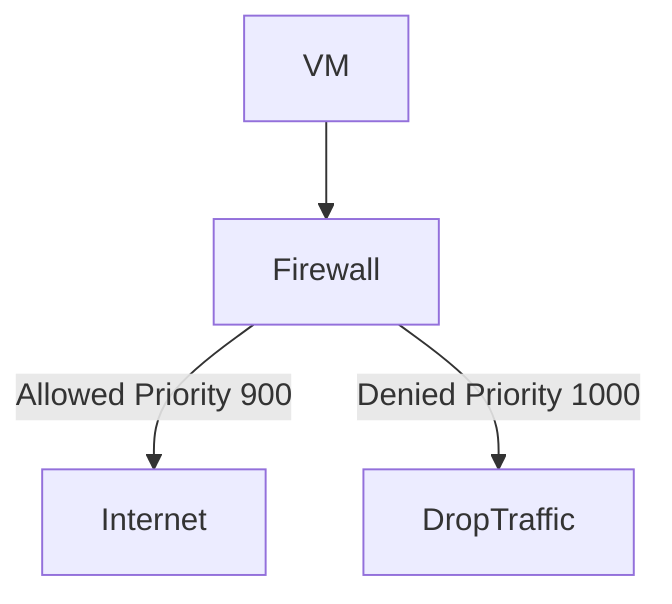
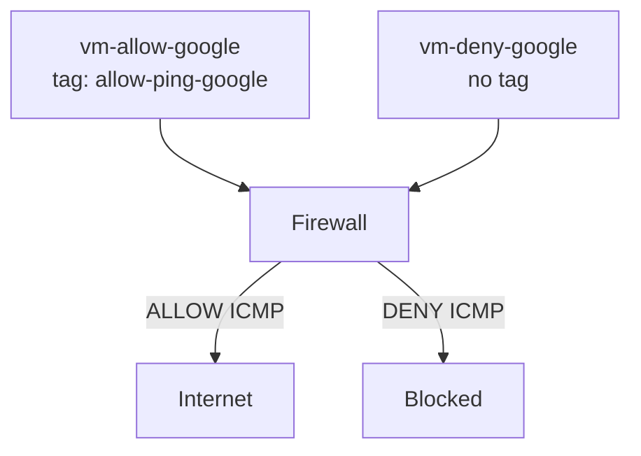
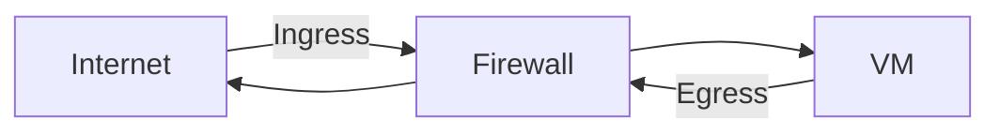

# Firewall Rules in Google Cloud (GCP)

Firewall rules in Google Cloud control **network traffic** to and from your Virtual Machine (VM) instances inside a **VPC network**.

They define:
- Who can connect
- From where
- Using which protocol and port
- To which VM instances

## What do Firewall Rules Control?

Firewall rules **control traffic at the network level**, not inside the VM.

They apply to:

- **Ingress traffic ->** Incoming traffic **to** VM instances
- **Egress traffic ->** Outgoing traffic **from** VM instances 

## Ingress = Traffic entering a VM
- By default, incoming traffic is denied unless explicitly allowed.
- To allow traffic into the VMs through SSH(TCP 22), ICMP(ping), HTTP(TCP 80) firewall rules must be created.
- Target tags identify which VMs the firewall rules apply to.
- Allow or deny depends on the priority level of the firewall rule.




## Egress = Traffic leaving the VM
- By default, outgoing traffic is allowed unless explicitly denied.
- To restrict the traffic outbound, egress firewall rules must be created. 
- Target tags identify which VMs the firewall rules apply to.
- Allow or deny depends on the priority level of the firewall rule 




## Priority level: 
Lower priority number = higher precedence

## How Firewall Rules Work in GCP

* Firewall rules are **stateful**
    - If ingress traffic is allowed, the response traffic is automatically allowed
* Rules are evaluated based on **priority**
    - Lower number = higher priority
* Firewall rules apply **only to VMs**
* Rules are applied using:
    - **Network tags,** or
    - **Service accounts**

## Key Components of a Firewall Rule

| Component | Description |
|---|---|
| Direction | INGRESS or EGRESS |
| Priority | Rule evaluation order (lower number = higher priority) |
| Action | ALLOW or DENY |
| Network | VPC where the rule applies |
| Protocol & Ports | `tcp`, `udp`, `icmp` (for TCP/UDP you can specify ports like `tcp:22`) |
| Source | Source IP ranges or source tags (Ingress) |
| Destination | Destination IP ranges (Egress) |
| Target | Network tags or service accounts |

## Example for reference 

## Configuration (Update Before Running)

```bash
export PROJECT_ID="your-project-id"
export REGION_ID="us-central1"
export ZONE_ID="us-central1-a"
export VPC_NAME="custom-vpc"
export SUBNET_NAME="subnet-a"
export MACHINE_TYPE="e2-micro"

gcloud config set project $PROJECT_ID
```

### Enable Compute API

```bash
echo "Enabling Compute API..."
gcloud services enable compute.googleapis.com
```

### Create a custom network $VPC_NAME 

```bash
gcloud compute networks create $VPC_NAME \
  --subnet-mode=custom
echo "Network $VPC_NAME created successfully..."
```

### Create a Subnet in custom-vpc

```bash
gcloud compute networks subnets create $SUBNET_NAME \
  --network=$VPC_NAME \
  --region=$REGION_ID \
  --range=10.2.1.0/24
echo "$SUBNET_NAME created successfully..."
```

### Creating VM Instances in the Subnet

### Create an Instance (vm-allow-google)

```bash
gcloud compute instances create vm-allow-google \
  --zone=$ZONE_ID \
  --subnet=$SUBNET_NAME \
  --machine-type=$MACHINE_TYPE \
  --tags=allow-ping-google
echo "Instance vm-allow-google created successfully.."
```

### Create an Instance (vm-deny-google)

```bash
gcloud compute instances create vm-deny-google \
    --zone=$ZONE_ID\
    --subnet=$SUBNET_NAME \
    --machine-type=$MACHINE_TYPE
echo "Instance vm-deny-google created successfully.."
```

### Example Firewall rules

### Allow SSH Access 

```bash
gcloud compute firewall-rules create allow-ssh \
  --description="allow-ssh port 22 for all instances " \
  --direction=INGRESS \
  --priority=1000 \
  --network=$VPC_NAME \
  --action=ALLOW \
  --rules=tcp:22 \
  --source-ranges=0.0.0.0/0
echo "Firewall rule allow SSH created successfully.."
```

### Allows ICMP

```bash
gcloud compute firewall-rules create allow-icmp-subnet-a \
  --description="allow icmp from subnet-a 10.2.1.0/24" \
  --direction=INGRESS \
  --priority=1000 \
  --network=$VPC_NAME \
  --action=ALLOW \
  --rules=icmp \
  --source-ranges=10.2.1.0/24
echo "Firewall rule allow-icmp created successfully.."
```
> This rule allows ICMP traffic originating from subnet to all VMs in the VPC.


### Log in to VM 
> This allows to login into vm-allow-google instance

```bash
gcloud compute ssh vm-allow-google --zone=$ZONE_ID \
  --project=$PROJECT_ID
```

> This allows to login into vm-deny-google 

```bash
gcloud compute ssh vm-deny-google  --zone=$ZONE_ID \
  --project=$PROJECT_ID
```

## Creating firewall rules to allow or deny egress traffic 

###  Deny ICMP egress to Google DNS (8.8.8.8)

```bash
gcloud compute firewall-rules create deny-google \
    --direction=EGRESS \
    --priority=1000 \
    --network=$VPC_NAME \
    --action=DENY \
    --rules=icmp \
    --destination-ranges=8.8.8.8/32
```
> This firewall rule denies ICMP egress traffic to 8.8.8.8 for all VMs unless overridden by a higher-priority allow rule. 

### Allow egress traffic to ping Google 

```bash
gcloud compute firewall-rules create allow-google \
    --direction=EGRESS \
    --priority=900 \
    --network=$VPC_NAME \
    --action=ALLOW \
    --rules=icmp \
    --destination-ranges=8.8.8.8/32 \
    --target-tags=allow-ping-google
```

> This firewall rule allows the egress traffic only to the VM with specific target tag allow-ping-google as the priority is 900 

### Target Tags

- Target tags decide which VM(s) the rule applies to.
- If no target tags are specified, the rule applies to all VMs in the network.






### Firewalls are created for Egress traffic 

Run this command **inside each VM** (after SSH):

```bash
ping -c 4 8.8.8.8
```

- Here instance vm-allow-google allows egress traffic and vm-deny-google denies egress traffic.

## Default Firewall Rules in GCP

Every VPC comes with default firewall rules such as:

    - Allow internal traffic within the VPC
    - Allow SSH, RDP, ICMP from anywhere (in default VPC)

**Best practice:** Do not use the default VPC in production

## Firewall Rules Best Practices

    - Use network tags instead of wide IP ranges
    - Follow least privilege
    - Avoid 0.0.0.0/0 unless required
    - Use DENY rules with higher priority carefully
    - Regularly audit firewall rules

## Cleanup (Avoid Charges)

```bash
gcloud compute firewall-rules delete allow-ssh allow-icmp-subnet-a deny-google allow-google
gcloud compute instances delete vm-allow-google vm-deny-google --zone=$ZONE_ID
gcloud compute networks subnets delete $SUBNET_NAME --region=$REGION_ID
gcloud compute networks delete $VPC_NAME
```

### Note: 
Firewall rules operate at the VPC level. OS-level firewalls inside the VM (iptables, ufw) are separate.(will learn that in coming chapters)


