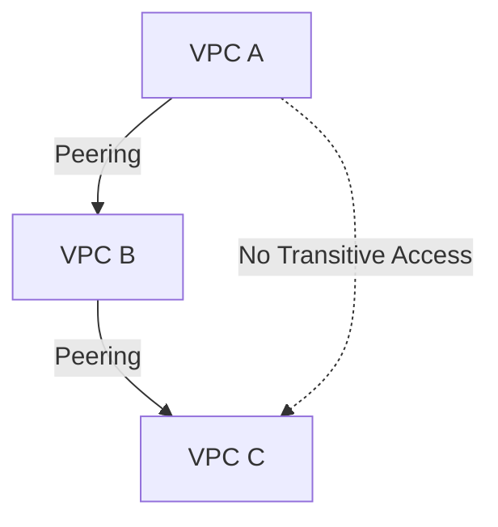

# VPC Peering
VPC Peering is used to connect two VPC networks within Google Cloud so they can communicate with each other using internal IP addresses.
Peering provides private, internal connectivity.

## Restrictions & Characteristics: 

1. The CIDR Range of the peered VPC networks must not overlap.
2. VPC peering works only between Google Cloud VPC networks.
3. Once peered, all subnets in the VPCs are routable. Firewalls can used to restrict traffic.
4. Firewall rules (including network tags and service accounts) are evaluated in the destination VPC for peered traffic.
5. Firewall rules are not shared between VPCs. Each VPC enforces its own firewall rules independently.
6. VPC peering is non-transitive. If VPC-1 is peered with VPC-2 and VPC-2 is peered with VPC-3, VPC-1 cannot communicate with VPC-3

