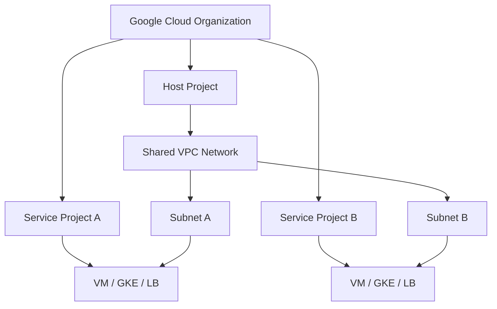

# Shared VPC

**Shared VPC** allows multiple projects within the same Google Cloud organization to share a common VPC network.
This enables centralized network management while allowing teams to deploy resources in separate projects.
**Important:** Host and service projects must belong to the same organization.
The only exception is during an organization migration, where service projects may temporarily belong to a different organization.

**Types of projects in Shared VPC**

A project participating in Shared VPC can be one of the following:

## **Host project:**
  - Contains one or more Shared VPC networks.
  - Owns & Manages:
      - VPC networks
      - Subnets
      - Firewall rules
      - Routes
  - Acts as the central networking project

## **Service project:** 
  - Attached to a host project by a Shared VPC Admin.
  - Uses subnets from the host project
  - Deploys resources such as:
      - VM instances
      - Load balancers
      - GKE clusters

## **Standalone project:**
  - Does not participate in Shared VPC
  - Contains its own independent VPC networks
  - A standalone VPC is not shared with other projects

**Important rules:**
  - A project cannot be both a host project and a service project
  - A service project cannot host other service projects.
  - All networking is centrally controlled in the host project
  - IAM permissions control who can use which subnets

In Shared VPC, the Host Project centrally manages networking resources, while Service Projects deploy workloads into shared subnets without owning the VPC.
